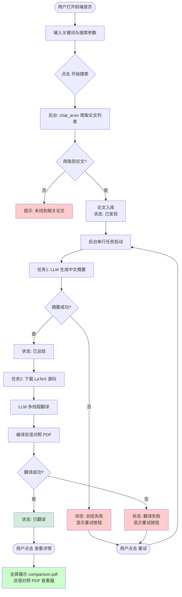
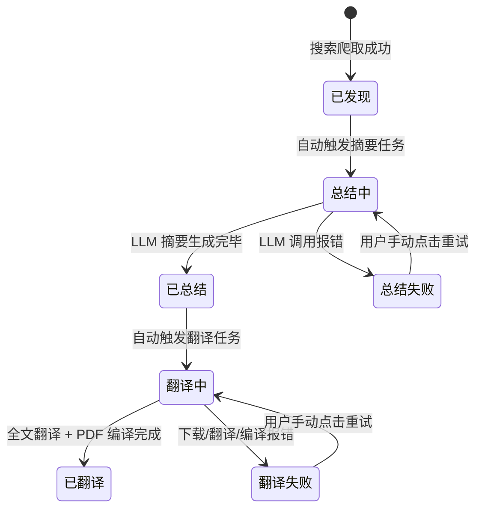
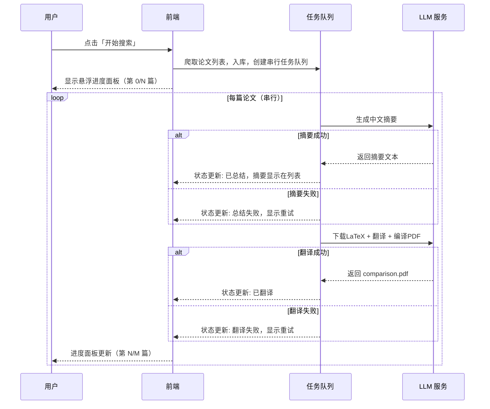

# 产品需求文档：ArXiv 论文翻译管理系统 - V1.0

## 1. 综述 (Overview)

### 1.1 项目背景与核心问题

研究人员在跟踪 ArXiv 最新论文时面临两大痛点：**语言障碍**（论文均为英文）和**时间成本**（手动逐篇阅读效率低下）。本系统的目标是将现有的两个命令行工具（`chat_arxiv.py` 关键词爬取+AI摘要、`main.py` LaTeX全文翻译）整合为一个**带前端界面的自动化流水线**，实现从"搜索关键词"到"阅读中文对照版论文"的全流程自动化。

系统为**本地单用户**使用设计，无需权限管理，重点在于**流水线自动化**与**论文库的可视化管理**。

---

### 1.2 核心业务流程 / 用户旅程地图

1. **阶段一：发现** - 用户输入关键词，系统自动搜索并爬取最新 ArXiv 论文
2. **阶段二：入库** - 爬取到的论文自动进入本地论文库，状态可在首页统一查看
3. **阶段三：总结** - 后台自动串行调用 LLM 为每篇论文生成中文摘要
4. **阶段四：翻译** - 总结完成后自动串行下载 LaTeX 源码、LLM 多线程翻译、编译双语对照 PDF
5. **阶段五：阅读** - 用户点击论文详情，全屏查看双语对照 PDF（`comparison.pdf`）

---

### 1.3 Mermaid 图

#### 1.3.1 用户操作流



#### 1.3.2 论文状态机



#### 1.3.3 关键场景时序（串行任务队列）



---

## 2. 用户故事详述 (User Stories)

### 阶段一 & 二：发现与入库

---

#### **US-01: 作为本地用户，我希望在首页看到论文库全貌，以便于快速掌握当前处理进度**

- **价值陈述**:
  - **作为** 本地研究用户
  - **我希望** 在一个页面里看到：已发现/已总结/已翻译的论文数量统计、全部论文列表（含状态和AI摘要预览）、以及后台任务进度
  - **以便于** 不需要打开命令行，随时了解系统整体运行状况

- **业务规则与逻辑**:
  1. **前置条件**: 系统已在本地运行后端服务，前端可通过 HTTP API 读取本地论文数据库
  2. **操作流程 (Happy Path)**:
     - 用户打开浏览器访问本地前端地址
     - 顶部统计面板显示三个数字卡片：已发现总数 / 已总结数 / 已翻译数
     - 列表区域显示所有论文，每行包含：状态图标 + 论文标题 + AI摘要（最多2行，已总结的论文才显示）+ 发布日期 + 操作按钮
     - 状态过滤标签栏允许按状态筛选列表，标签：`全部 / 已翻译 / 已总结 / 处理中 / 失败`
     - 列表支持分页，每页显示若干条
     - 当后台有任务运行时，右下角出现悬浮进度面板，显示整个队列进度
  3. **异常处理**:
     - 本地数据库为空：列表区显示「暂无论文，请使用搜索功能添加」提示
     - 后端服务未启动：页面显示连接失败提示

- **页面布局线框图**:
  ```text
  ┌─────────────────────────────────────────────────────────────────┐
  │  🔬 ArXiv 论文翻译系统                           [设置]  [日志] │
  ├─────────────────────────────────────────────────────────────────┤
  │  ┌─────────────┐   ┌─────────────┐   ┌─────────────┐          │
  │  │  📄 已发现  │   │  ✅ 已总结  │   │  🌐 已翻译  │          │
  │  │    42 篇    │   │    31 篇    │   │    18 篇    │          │
  │  └─────────────┘   └─────────────┘   └─────────────┘          │
  ├─────────────────────────────────────────────────────────────────┤
  │ [全部(42)] [已翻译(18)] [已总结(31)] [处理中(3)] [失败(2)]      │
  ├───────┬──────────────────────────────────┬────────┬────────────┤
  │ 状态  │ 论文标题 + AI摘要预览             │发布日期│ 操作       │
  ├───────┼──────────────────────────────────┼────────┼────────────┤
  │ ✅翻译│ Attention Is All You Need        │2023-06 │[查看详情]  │
  │       │ 💬 本文提出Transformer架构...    │        │            │
  ├───────┼──────────────────────────────────┼────────┼────────────┤
  │ ⏳总结│ FlowNet: Scene Flow Estimation   │2024-01 │     -      │
  │       │ 💬 总结中...                      │        │            │
  ├───────┼──────────────────────────────────┼────────┼────────────┤
  │ ❌失败│ CLIP: Contrastive Language...    │2024-02 │[重试]      │
  │       │ ⚠️ 翻译失败: LaTeX编译报错        │        │[查看详情]  │
  ├───────┴──────────────────────────────────┴────────┴────────────┤
  │ 共 42 篇    << [1] [2] [3] ... >>                               │
  └─────────────────────────────────────────────────────────────────┘
                                              ┌──────────────────────┐
                                              │ 📦 任务队列  (3/10)  │
                                              │ ▓▓▓▓░░░░░░░  30%    │
                                              │ 当前: 翻译 CLIP...   │
                                              │ 队列: FlowNet, GPT4  │
                                              └──────────────────────┘
  ```

- **验收标准**:
  - **场景1: 正常展示**
    - **GIVEN** 本地数据库中有论文数据
    - **WHEN** 用户打开首页
    - **THEN** 统计卡片显示正确数量，列表显示所有论文，已总结的论文在标题下方显示2行摘要预览
  - **场景2: 状态过滤**
    - **GIVEN** 列表中有多种状态的论文
    - **WHEN** 用户点击「失败」标签
    - **THEN** 列表只显示状态为总结失败或翻译失败的论文，其他论文被过滤
  - **场景3: 悬浮进度面板**
    - **GIVEN** 后台正在处理任务队列
    - **WHEN** 用户停留在首页
    - **THEN** 右下角悬浮面板实时更新，显示「第N/共M篇」和当前处理论文名称，任务全部完成后面板自动收起

---

#### **US-02: 作为本地用户，我希望通过输入关键词一键触发批量搜索与处理，以便于自动完成从发现到翻译的全流程**

- **价值陈述**:
  - **作为** 本地研究用户
  - **我希望** 在首页填写搜索参数后点击按钮，系统自动完成搜索→总结→翻译全流程
  - **以便于** 无需手动逐篇操作，一次操作后等待结果即可

- **业务规则与逻辑**:
  1. **前置条件**: 前端已打开，LLM 服务在本地运行
  2. **操作流程 (Happy Path)**:
     - 用户填写搜索参数：
       - `query`：ArXiv 搜索字符串（支持 `ti:` / `au:` / `all:` 前缀语法）
       - `keyword`：研究领域关键词，用于引导摘要生成
       - `days`：只搜索最近 N 天内的论文，默认 30
       - `max`：最多处理的论文数量，默认 10
     - 点击「开始搜索」按钮
     - 系统调用 `chat_arxiv` 爬取论文，结果实时列在列表中（状态：已发现）
     - 爬取完成后，后台串行任务队列自动启动，逐篇处理（总结→翻译）
     - 搜索按钮变为不可用状态，显示「处理中...」，直到所有任务完成
     - **已存在于库中的论文（相同 ArXiv ID）跳过，不重复处理**
  3. **异常处理**:
     - 网络超时/无搜索结果：提示「未找到相关论文，请调整搜索参数」
     - 爬取到论文但 LLM 不可用：论文入库（已发现），总结步骤标记为失败

- **验收标准**:
  - **场景1: 成功搜索并触发流水线**
    - **GIVEN** 用户填写了 query 和 keyword
    - **WHEN** 点击「开始搜索」
    - **THEN** 列表中出现新论文（状态：已发现），右下角进度面板出现并开始计数
  - **场景2: 重复论文跳过**
    - **GIVEN** 数据库中已有 arxiv_id=2301.07041 的论文
    - **WHEN** 新搜索结果包含同一论文
    - **THEN** 该论文不被重复入库，进度计数正确排除该论文

---

### 阶段三 & 四：总结与翻译

---

#### **US-03: 作为本地用户，我希望系统在后台自动串行完成摘要生成和全文翻译，以便于我无需手动干预**

- **价值陈述**:
  - **作为** 本地研究用户
  - **我希望** 触发搜索后，系统完全自动地依次为每篇论文生成摘要、翻译全文
  - **以便于** 我可以去做其他事情，稍后回来查看已完成的论文

- **业务规则与逻辑**:
  1. **前置条件**: 论文已进入数据库（状态：已发现），LLM 服务可用
  2. **操作流程 (Happy Path)**:
     - 系统按论文入库顺序逐篇处理，同一时间只处理一篇（串行，不并发）
     - **步骤 A - 总结**：调用 `chat_arxiv.py` 中的 `PaperSummarizer`，生成中文摘要，保存到本地数据库
     - **步骤 B - 翻译**：调用 `main.py` 中的 `translate_arxiv_paper()`：
       - 下载 LaTeX 源码（使用 ArxivDownloader）
       - LLM 多线程翻译各片段
       - 编译生成 `comparison.pdf`（双语对照）和中文 PDF
       - 默认开启 PDF 编译（本地已安装 LaTeX）
     - 每完成一步，更新数据库中该论文的状态
     - 右下角悬浮进度面板实时更新：显示「第 N/共 M 篇」+ 当前任务名（总结中/翻译中）+ 剩余论文列表
  3. **异常处理**:
     - 某篇总结失败：该论文标记为「总结失败」，后台**继续处理下一篇**（不中断整个队列）
     - 某篇翻译失败（LaTeX源码不可用 / 编译错误）：该论文标记为「翻译失败」，继续下一篇
     - LLM 服务中途不可用：当前任务标记失败，后台任务队列暂停，等待用户重试

- **验收标准**:
  - **场景1: 串行处理全部成功**
    - **GIVEN** 队列中有 5 篇论文，LLM 服务正常
    - **WHEN** 任务队列自动运行
    - **THEN** 5 篇论文依次从「已发现」→「总结中」→「已总结」→「翻译中」→「已翻译」流转，进度面板从 1/5 更新到 5/5，完成后面板收起
  - **场景2: 部分失败不中断队列**
    - **GIVEN** 第 2 篇论文的 LaTeX 源码无法下载
    - **WHEN** 翻译任务执行到第 2 篇
    - **THEN** 第 2 篇标记为「翻译失败」并显示重试按钮，系统继续处理第 3 篇，不中断整体流程

---

### 阶段五：阅读

---

#### **US-04: 作为本地用户，我希望在详情页看到双语对照 PDF，以便于对照阅读并验证翻译准确性**

- **价值陈述**:
  - **作为** 本地研究用户
  - **我希望** 点击论文的「查看详情」后进入一个全屏的 PDF 查看器，显示由 `main.py` 自动生成的 `comparison.pdf`（双语对照版本）
  - **以便于** 在一个文件中同时看到原文和译文，方便核查翻译质量

- **业务规则与逻辑**:
  1. **前置条件**: 该论文状态为「已翻译」，本地已生成 `comparison.pdf`
  2. **操作流程 (Happy Path)**:
     - 用户在首页列表点击「查看详情」
     - 进入详情页，顶部显示论文标题、arXiv ID、发布日期、当前状态
     - 主区域为全屏 PDF 内嵌查看器（iframe），加载本地 `comparison.pdf`
     - 提供「下载原文 PDF」和「下载译文 PDF」两个按钮（分别链接到本地原文和中文 PDF）
     - 左上角「← 返回」按钮回到首页列表
  3. **异常处理**:
     - 论文尚未翻译（仅已总结状态）：可进入详情页，但 PDF 区域显示「翻译尚未完成」提示，显示论文的 AI 摘要文本作为降级展示
     - `comparison.pdf` 文件损坏无法加载：显示错误提示，提供「重新翻译」按钮

- **页面布局线框图**:
  ```text
  ┌──────────────────────────────────────────────────────────────────┐
  │ ← 返回列表  │  Attention Is All You Need  [2023-06]  ✅ 已翻译  │
  │             │  arXiv: 1706.03762    [下载原文PDF] [下载译文PDF]  │
  ├──────────────────────────────────────────────────────────────────┤
  │                                                                  │
  │   ┌──────────────────────────────────────────────────────────┐  │
  │   │                                                          │  │
  │   │           comparison.pdf  (双语对照)                     │  │
  │   │                                                          │  │
  │   │   第一章 Introduction | 第一章 引言                      │  │
  │   │   We present...       | 我们提出...                      │  │
  │   │                                                          │  │
  │   │   第二章 Method       | 第二章 方法                      │  │
  │   │   Our approach...     | 我们的方法...                    │  │
  │   │                                                          │  │
  │   │              (PDF 内嵌查看器 / iframe)                   │  │
  │   │                                        ↕ 可滚动          │  │
  │   └──────────────────────────────────────────────────────────┘  │
  │                                                                  │
  └──────────────────────────────────────────────────────────────────┘
  ```

- **验收标准**:
  - **场景1: 已翻译论文正常打开**
    - **GIVEN** 论文状态为「已翻译」，comparison.pdf 存在
    - **WHEN** 用户点击「查看详情」
    - **THEN** 详情页加载，PDF 查看器显示双语对照内容，两个下载按钮可用
  - **场景2: 未翻译论文降级展示**
    - **GIVEN** 论文状态为「已总结」（翻译未完成）
    - **WHEN** 用户点击「查看详情」
    - **THEN** PDF 区域显示「翻译尚未完成」，下方展示 AI 生成的中文摘要文本

---

#### **US-05: 作为本地用户，我希望对处理失败的论文点击重试，以便于无需重新搜索即可恢复处理**

- **价值陈述**:
  - **作为** 本地研究用户
  - **我希望** 对列表中「总结失败」或「翻译失败」的论文点击重试按钮，系统重新触发该步骤
  - **以便于** 快速恢复因网络/LLM抖动导致的失败，无需重跑整个搜索流程

- **业务规则与逻辑**:
  1. **前置条件**: 论文状态为「总结失败」或「翻译失败」
  2. **操作流程 (Happy Path)**:
     - 用户在首页列表找到失败的论文，点击「重试」按钮
     - 该论文被重新加入任务队列尾部
     - 状态从「失败」变为「总结中」或「翻译中」，重试按钮消失
     - 悬浮进度面板显示更新后的队列
  3. **异常处理**:
     - 重试仍然失败：重新标记为失败状态，重试按钮重新出现，并在失败提示中显示具体错误原因（如「LaTeX编译报错」）

- **验收标准**:
  - **场景1: 重试成功**
    - **GIVEN** 论文状态为「翻译失败」
    - **WHEN** 用户点击「重试」
    - **THEN** 状态变为「翻译中」，悬浮进度面板更新，最终状态变为「已翻译」
  - **场景2: 重试再次失败**
    - **GIVEN** 论文状态为「总结失败」
    - **WHEN** 用户点击「重试」，LLM 服务仍不可用
    - **THEN** 状态重新变为「总结失败」，列表显示具体错误原因

---

## 3. 非功能性需求

| 类别 | 要求 |
|------|------|
| **运行环境** | 本地单用户，无需多用户/权限管理 |
| **任务处理** | 总结与翻译串行执行，同一时间只处理一篇论文 |
| **PDF 编译** | 默认开启，依赖本地已安装的 LaTeX 环境 |
| **数据持久化** | 论文元数据（标题/状态/摘要/文件路径）存储到本地数据库（SQLite 或 JSON 文件） |
| **现有代码复用** | 复用 `chat_arxiv.py`（总结）和 `main.py`（翻译），以后端 API 形式暴露给前端 |
| **前端技术** | 浏览器本地访问，单页应用，无需打包部署 |
| **日志** | 后台处理日志可在「日志」入口查看，翻译日志对应 `arxiv_translator.log` |

---

## 4. 超出本期范围（非目标）

- 多用户支持 / 用户登录认证
- 云端部署
- 论文自动推送 / 定时调度（本期为手动触发搜索）
- 翻译语言切换（本期固定为中文）
- PDF 注释 / 高亮功能
