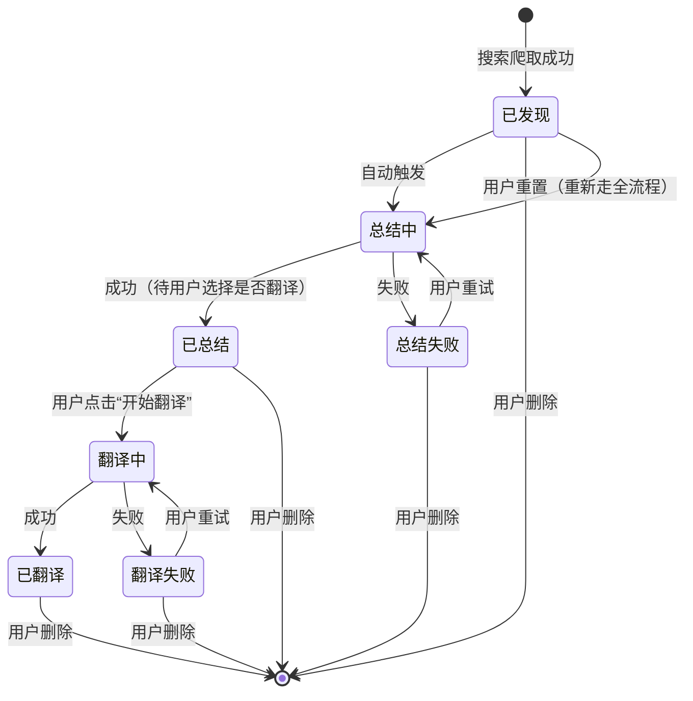

# 产品需求文档：ArXiv 论文翻译管理系统 - V2.0（论文库管理）

## 1. 综述 (Overview)

### 1.1 背景与问题

PRD-001（V1.0）实现了论文搜索→摘要→翻译→阅读的自动化流水线，但系统只能**只写入、不删除**。用户在调试阶段（如翻译失败、重试失败、测试新功能）会积累大量"垃圾论文"，且每篇论文编译产生的 LaTeX 缓存可达 50~200MB，长期无法清理。

此外，服务器进程崩溃后会遗留 `status=RUNNING` 的僵尸任务，导致下次重启后 Worker 跳过这些任务，任务队列卡死。

同时，当前流程会在摘要完成后自动触发翻译，用户无法选择是否翻译，导致不必要的算力消耗与等待时间。

### 1.2 本版本目标

为系统补全**论文生命周期管理**能力：

1. **删除**：支持单篇删除和批量清空失败项，联动清理磁盘缓存
2. **重置**：将论文状态重置为初始，重新触发完整处理流程
3. **可靠性**：服务启动时自动检测并修复僵尸任务
4. **可控翻译**：论文摘要完成后由用户显式选择是否翻译，不再自动翻译

---

### 1.3 状态机变更（扩展 PRD-001）

PRD-001 的状态机在“翻译触发条件”上调整，并新增两个入口：



---

## 2. 用户故事详述

### **US-06: 作为本地用户，我希望能删除不需要的论文，以便于保持库的整洁并释放磁盘空间**

- **价值陈述**:
  - **作为** 本地研究用户
  - **我希望** 在论文列表里对任意论文点击删除，系统删除数据库记录和磁盘文件
  - **以便于** 调试期间快速清理失败/测试论文，节省磁盘空间

- **业务规则与逻辑**:
  1. **前置条件**: 论文状态为非"处理中"（非 summarizing / translating）
  2. **操作流程 (Happy Path)**:
     - 用户鼠标悬浮到论文卡片上，右侧显示 🗑 删除按钮
     - 点击后弹出确认对话框，显示论文标题
     - 确认后：后端同步删除数据库记录 + 联动清理磁盘文件
     - 卡片以淡出动画移除，toast 显示"已删除 · 释放 XX MB"
  3. **异常处理**:
     - 论文正在处理中（RUNNING 任务）：提示"论文正在处理中，请等待完成后删除"，不执行删除
     - `?force=true` 参数（API 层）：强制取消 RUNNING/PENDING 任务，然后删除（前端暂不提供此入口，仅供调试用）

- **删除联动清理的文件**:
  - `arxiv_cache/<arxiv_id>/`（整个目录，含 LaTeX 源码和编译中间文件）
  - `comparison_pdf_path`、`translated_pdf_path`（若在 cache 目录内则已随目录删除）
  - `TaskQueue` 中的相关记录（通过数据库 CASCADE 自动删除）

- **页面布局**:
  ```text
  ┌──────┬──────────────────────────────────────┬────────────────────────────────┐
  │ 状态  │ 标题 + 摘要                          │ 日期  [查看] [重试] [🗑]       │
  └──────┴──────────────────────────────────────┴────────────────────────────────┘
                                                         ↑ 鼠标悬浮才显示
  ```

- **验收标准**:
  - **场景1: 正常删除**
    - **GIVEN** 论文状态为「已翻译」或「已总结」
    - **WHEN** 点击 🗑 → 确认
    - **THEN** 卡片消失，统计数字减少，磁盘缓存被清理
  - **场景2: 阻止删除处理中论文**
    - **GIVEN** 论文状态为「总结中」或「翻译中」
    - **THEN** 删除按钮不显示（前端隐藏）
  - **场景3: 删除已发现/失败论文**
    - **GIVEN** 论文状态为「已发现」或「翻译失败」
    - **WHEN** 点击 🗑 → 确认
    - **THEN** 论文被删除，不影响 Worker 继续处理其他论文

---

### **US-07: 作为本地用户，我希望一键清空所有失败的论文，以便于快速清理调试垃圾**

- **价值陈述**:
  - **作为** 本地研究用户
  - **我希望** 在列表顶部点击「清空失败项」，批量删除所有 summary_failed / translation_failed 状态的论文
  - **以便于** 无需逐条操作，快速恢复到干净的状态

- **业务规则与逻辑**:
  1. 按钮位于过滤标签栏右侧，始终可见
  2. 点击后弹出确认对话框
  3. 批量删除所有失败论文（串行逐条，联动清理文件）
  4. toast 显示"已清空 N 篇失败论文，释放 XX MB"

- **验收标准**:
  - **GIVEN** 列表中有 5 篇总结失败、3 篇翻译失败的论文
  - **WHEN** 点击「清空失败项」→ 确认
  - **THEN** 8 篇论文全部消失，统计数字更新

---

### **US-08: 作为本地用户，我希望重置论文状态，以便于调试时重新触发全流程**

- **价值陈述**:
  - **作为** 本地研究用户
  - **我希望** 对任意论文调用重置 API，清空处理结果，让论文重新走摘要流程，并在摘要完成后自行决定是否翻译
  - **以便于** 在修复了 LLM 配置或提示词后，不需要删除重新搜索，即可重新处理

- **业务规则与逻辑**:
  - 调用 `POST /api/papers/<id>/reset`
  - 论文状态重置为 `discovered`，清空 `summary_zh`、`summary_error`、`translation_error`
  - 自动重新入队 summarize 任务；翻译任务不自动入队
  - **本版本前端不提供入口**（仅 API 可用，供高级用户调试）

---

### **US-10: 作为本地用户，我希望在摘要完成后自行选择是否翻译，以避免不必要的翻译任务**

- **价值陈述**:
  - **作为** 本地研究用户
  - **我希望** 论文处于「已总结」状态时，可手动点击“开始翻译”
  - **以便于** 只翻译真正需要深入阅读的论文，减少等待和资源占用

- **业务规则与逻辑**:
  1. 默认行为：论文爬取并摘要完成后，状态停留在 `summarized`，不自动创建翻译任务
  2. 用户触发：用户在「已总结」论文上点击“开始翻译”后，系统创建 translation 任务并进入 `translating`
  3. 防重复触发：若论文已在 `translating` / `translated`，再次触发返回幂等结果，不重复入队
  4. 失败重试：`translation_failed` 状态仍可通过“重试翻译”重新入队

- **验收标准**:
  - **场景1: 不自动翻译**
    - **GIVEN** 一篇论文已完成摘要，状态为 `summarized`
    - **WHEN** 用户未点击“开始翻译”
    - **THEN** 队列中不出现该论文的 translation 任务，论文保持 `summarized`
  - **场景2: 用户触发翻译**
    - **GIVEN** 一篇论文状态为 `summarized`
    - **WHEN** 用户点击“开始翻译”
    - **THEN** 系统创建 translation 任务，论文状态进入 `translating`
  - **场景3: 已翻译论文重复触发**
    - **GIVEN** 一篇论文状态为 `translated`
    - **WHEN** 用户再次点击“开始翻译”
    - **THEN** 系统不重复创建任务，返回“已翻译/无需重复触发”

---

### **US-09: 作为本地用户，我希望系统启动时自动修复异常状态，以便于不用手动干预任务队列**

- **价值陈述**:
  - **作为** 本地研究用户
  - **我希望** 即使上次 server.py 被强制关闭，下次启动时系统自动检测并修复残留的 RUNNING 任务
  - **以便于** 不會因为一次崩溃导致任务队列永久卡死

- **业务规则与逻辑**:
  1. `server.py` 启动时，`main()` 调用 `db.reset_stuck_tasks()`
  2. 将所有 `status=RUNNING` 的 TaskQueue 记录改回 `PENDING`
  3. 对应论文：`SUMMARIZING → DISCOVERED`，`TRANSLATING → SUMMARIZED`
  4. 启动日志中打印"已修复 N 个僵尸任务"（N>0 时警告级别）

- **验收标准**:
  - **GIVEN** 数据库中有一条 `status=RUNNING` 的 TaskQueue 记录
  - **WHEN** 重启 `server.py`
  - **THEN** 日志打印修复信息，该任务变为 PENDING，Worker 正常拾取并执行

---

## 3. 新增 API 端点

| 方法 | 路径 | 说明 |
|------|------|------|
| `DELETE` | `/api/papers/<arxiv_id>` | 删除单篇论文（含磁盘文件），`?force=true` 强制取消任务 |
| `POST` | `/api/papers/<arxiv_id>/reset` | 状态重置为 discovered，重新入队 |
| `POST` | `/api/papers/<arxiv_id>/translate` | 用户手动触发翻译；仅 `summarized` / `translation_failed` 可触发 |
| `DELETE` | `/api/papers` | 批量删除，`?status=failed` 清空失败项 |

---

## 4. 非功能性需求

| 类别 | 要求 |
|------|------|
| **数据安全** | 删除操作需二次确认（前端 confirm 弹窗），不可撤销 |
| **磁盘清理** | 删除时联动清理 `latex_cache_dir` 整个目录（shutil.rmtree） |
| **并发安全** | 有 RUNNING 任务时默认阻止删除，`force=true` 时先取消任务再删除 |
| **任务幂等** | `POST /api/papers/<arxiv_id>/translate` 对同一论文重复请求不得重复创建翻译任务 |
| **幂等性** | `reset_stuck_tasks()` 每次启动均可调用，零僵尸任务时无副作用 |

---

## 5. 超出本期范围（非目标）

- 删除确认弹窗中显示"将释放 XX MB"（磁盘分析较慢，本期用删后 toast 展示）
- 批量选择并删除特定论文（仅支持按状态批量）
- 已删除论文的操作历史记录
- NotebookLM 集成（见 PRD-003）
